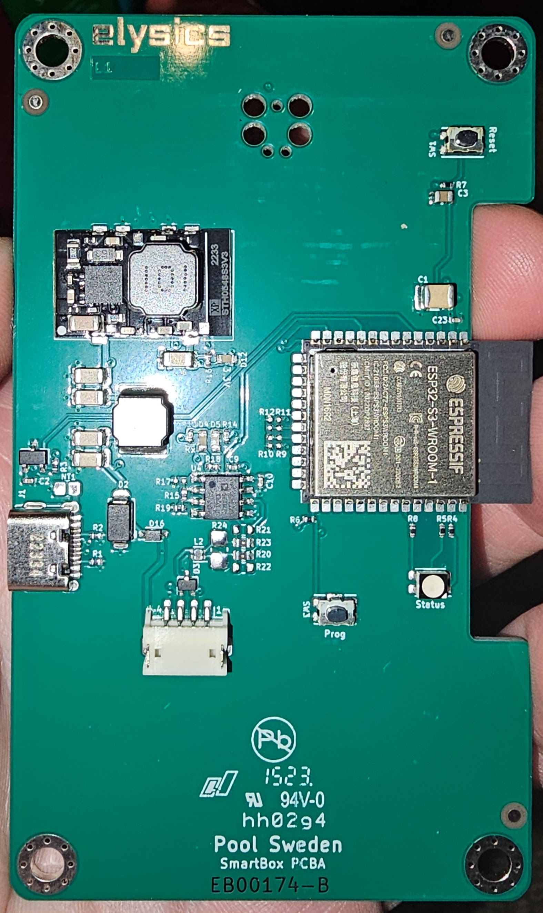
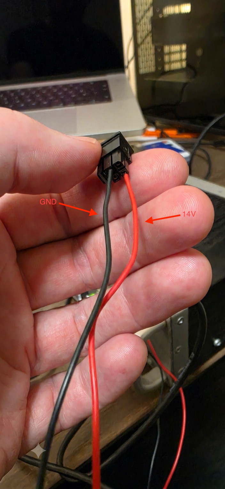
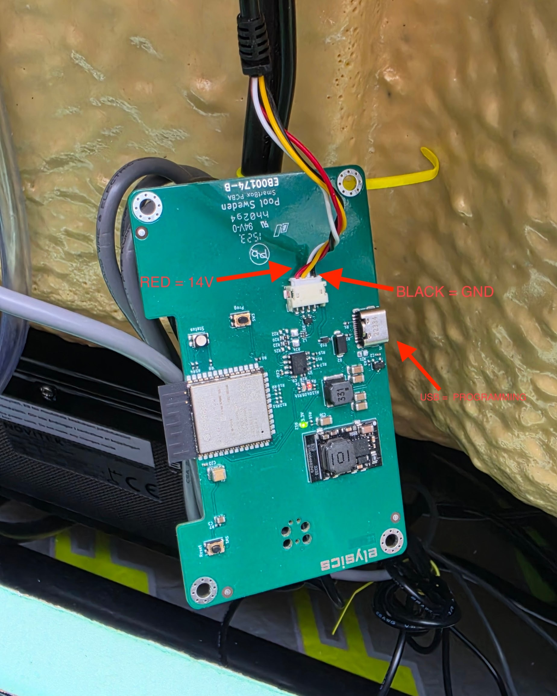

# Zavepower Energy Optimizer → Home Assistant (ESPHome)

A ready-to-use [ESPHome](https://esphome.io) config that reflashes the deprecated
**Zavepower Energy Optimizer** / elysics "Pool Sweden SmartBox" board (marking
`EB00174-B`, built around an ESP32-S3-WROOM-1) and turns it into a WiFi bridge
between your **Balboa spa** and **Home Assistant**. It also exposes the board's
onboard RGB LED as a controllable light.

Everything you need is in **`zavepower_energy_optimizer.yaml`** — confirmed GPIO
pinout, spa UART settings, and a representative set of spa entities.

Spa communication is handled by the **`balboa_spa`** ESPHome external component by
[brianfeucht/esphome-balboa-spa](https://github.com/brianfeucht/esphome-balboa-spa)
(pinned to `v2.24`). This repo only provides the board-specific config plus the
wiring and setup docs below — for the component's own documentation and the full
list of spa entities you can add (jets, lights, fault log, filter schedules,
water heater, etc.), see that upstream repo.

> ⚠️ **This permanently erases the original Zavepower firmware.** Flashing
> ESPHome overwrites the stock firmware, and there is **no way to restore it** —
> no backup or factory image is available, so the board will no longer work with
> the original Zavepower/Pool Sweden cloud service or app. **Proceed entirely at
> your own risk.**

> **Tested hardware:** This has been tested on a **Novitek Luosto S** spa. That
> is the only spa I have access to, so I have no way to test any other spa models
> — other Balboa-based spas will likely work, but I can't verify them. Reports
> (and PRs) from other spas are welcome.

## The board



Key features to locate on your board:

- **ESP32-S3-WROOM-1** — the WiFi module (top right).
- **USB-C connector** — used for the first flash and serial logs (left edge).
- **4-pin JST connector** — the spa harness; carries **14 V power + RS-485 data**
  to/from the spa controller (bottom center).
- **Prog** button — hold to enter the ESP32 bootloader.
- **Reset** button — reboots the board.
- **RGB LED** (labelled *Status*) — a full-color LED exposed to Home Assistant.
  You can drive it yourself to signal whatever you like — e.g. define your own
  color codes for heating, filtering, or fault states (see the commented example
  at the bottom of `zavepower_energy_optimizer.yaml`). Note that once the board
  is installed the LED is normally hidden inside the enclosure, so it's mostly
  useful during bench testing.

## Powering the board

The ESP32 side needs **14 V** on the power input; the onboard buck converter
steps it down to 3.3 V. **USB-C is used for programming/logs only** and does not
power the board. So during setup you power the board one of two ways *and* plug
in USB-C for flashing.

**Option A — external bench supply (recommended for setup on the bench)**

Feed 14 V into the 2-pin power connector: **red = 14 V, black = GND**.



**Option B — power from the spa harness (in place, on the spa)**

The spa's own 4-pin cable already provides 14 V and GND, so once the board is
wired to the spa it is powered by the spa. Plug in USB-C for flashing.



> ⚠️ **Never connect both** the external supply **and** the spa harness 14 V at
> the same time — pick one power source. USB-C can stay connected in either case.

## Confirmed GPIO pinout (EB00174 board)

The pins below were confirmed on-hardware. The `substitutions` in
`zavepower_energy_optimizer.yaml` already use these values, so you shouldn't need to
change them on the same board revision.

| Signal | GPIO | Notes |
|---|---|---|
| Spa UART RX | `GPIO18` | ADM3483 RO (pin 1); also the **red RX-activity LED** |
| Spa UART TX | `GPIO17` | ADM3483 DI (pin 4); also the **green TX-activity LED** |
| Spa UART direction | `GPIO6` | ADM3483 `/RE`+`DE`; `flow_control_pin` (drive HIGH to transmit) |
| RGB LED — red | `GPIO1` | common-anode (active-low → `inverted: true`) |
| RGB LED — green | `GPIO2` | common-anode |
| RGB LED — blue | `GPIO42` | common-anode |

The spa bus is a non-isolated half-duplex RS-485 link via an **Analog Devices
ADM3483** transceiver. The two single LEDs are wired directly on the UART RX/TX
lines, so they act as receive/transmit activity indicators (not separately
controllable). The RGB LED is exposed to Home Assistant as a controllable light.

Known by convention: Prog button = `GPIO0`, Reset = `EN`, USB-C = native USB.

If you have a different board revision, re-confirm the pins before flashing:
trace the ADM3483 transceiver for the UART pins (RO → RX, DI → TX, `/RE`+`DE` →
direction), and blink candidate GPIOs to locate the LEDs (noting active-high/low
polarity).

## Step-by-step setup (ESPHome Dashboard in Home Assistant — recommended)

This is the easiest path if you run Home Assistant OS/Supervised: you do
everything from the **ESPHome Device Builder** add-on's web UI in your browser,
and only need USB for the very first flash.

**1. Wire up the board.** Connect the Energy Optimizer to the spa's 4-pin harness (this
supplies 14 V + RS-485) *or*, for bench setup, feed 14 V into the 2-pin power
connector (red = 14 V, black = GND). See [Powering the board](#powering-the-board)
above. Use only one 14 V source.

**2. Install the ESPHome add-on.** In Home Assistant, go to **Settings → Add-ons
→ Add-on Store**, install **ESPHome Device Builder**, then **Start** it and click
**Open Web UI**. (This also installs the ESPHome integration.)

**3. Create the device config.** In the ESPHome dashboard click **+ New Device →
Continue**, give it a name (e.g. `zavepower-spa`), pick **ESP32-S3** if asked,
and **Skip** the wizard's WiFi step for now (you'll paste the full config next).
This generates an entry and its API/OTA keys in `secrets.yaml`.

**4. Paste in this config.** Click **Edit** on the new device and replace its
contents with `zavepower_energy_optimizer.yaml` from this repo. Then set your WiFi in the
ESPHome dashboard's **Secrets** editor (top-right menu → **Secrets**):

```yaml
wifi_ssid: "YourNetwork"
wifi_password: "YourPassword"
```

Check the temperature scale: `spa_temp_scale` is `C` by default — change it to
`F` if your spa topside panel is in Fahrenheit. (On a different board revision,
also update the pin `substitutions` to the values you confirmed above.)

**5. First flash over USB.** Plug the board into the machine running the ESPHome
dashboard via USB-C (make sure it's also powered per step 1). Click **Install →
Plug into this computer** (or **Plug into the computer running ESPHome Web** and
use [web.esphome.io](https://web.esphome.io) from Chrome/Edge if the add-on can't
see the port). If the upload fails, hold **Prog**, tap **Reset**, release
**Prog** to force the bootloader, and retry.

**6. Verify communication.** Click **Logs** on the device. You should see spa
messages being decoded and the **Spa Connected** sensor go on; the red/green
activity LEDs on the board blink with RS-485 RX/TX traffic. Frequent `CRC`
warnings are normal — see [Troubleshooting](#crc-errors).

**7. Add to Home Assistant.** Once on WiFi, HA auto-discovers the device under
**Settings → Devices & Services** (look for `zavepower-spa`). Click **Configure**
and confirm. All spa entities (thermostat, jets, lights, filter schedule, fault
log, RGB status LED, …) appear as one device.

**8. Done — future updates are wireless.** After the first USB flash, use
**Install → Wirelessly** in the ESPHome dashboard for all later changes; USB is
only needed again if the board can't reach the network.

### Alternative: flashing from the command line

If you don't run the Home Assistant add-on, you can use the ESPHome CLI instead:

```bash
pip install esphome
# create secrets.yaml next to the config with wifi_ssid / wifi_password
esphome run zavepower_energy_optimizer.yaml   # first flash over USB, OTA thereafter
esphome logs zavepower_energy_optimizer.yaml  # view logs
```

Then add it to Home Assistant as in step 7 above.

## Customizing the entities

The shipped config exposes a representative set of spa entities (thermostat,
jets, lights, filter scheduling, fault log, and more). To add or tweak entities,
edit `zavepower_energy_optimizer.yaml` — the full list of platforms and options
provided by the `balboa_spa` component is documented in the
[upstream esphome-balboa-spa repo](https://github.com/brianfeucht/esphome-balboa-spa).

To pull in newer component fixes later, bump the `ref:` in the config's
`external_components:` block from `v2.24` to a newer upstream tag.

## Troubleshooting

### CRC Errors

CRC errors are very common with Balboa spa controllers due to electrical
interference from heaters and pumps. Seeing frequent `CRC` messages in the logs
is normal and usually harmless. To silence them specifically while keeping other
DEBUG-level logging:

```yaml
logger:
  level: DEBUG
  logs:
    BalboaSpa.CRC: NONE  # Silence CRC error messages
```

## Screenshots

### ESP WebUI


### Home Assistant UI

